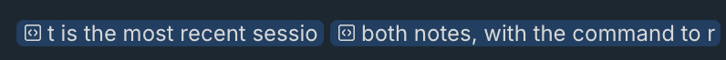
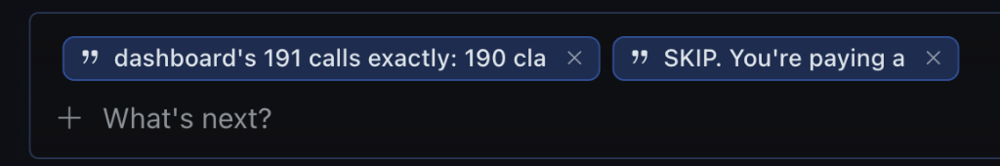

# hermes-quote-selection

A small Hermes Desktop plugin for quoting agent output back at the agent.

Select part of a reply, press **Cmd+Option+L**, and the text lands in the composer as a chip - the same gesture as Cmd+L in Devin. The chips sit inline, so you can type right next to them. When you send, each chip becomes `> ` quote lines where it sits.

Prefer clicking? Selecting text in a reply also pops up an **Add to chat** button.

## Why

Hermes replies are long, and most questions are about one sentence, not the whole thing. The built-in Cmd+L only handles terminal and file-preview selections - on chat messages it just focuses the input. So quoting meant copy, paste, add `> ` by hand:


Devin gets this right: select, press a key, get a chip inline in the input:



An earlier version of this plugin drew chips in a row *above* the input instead. It worked, but you couldn't tell where a quote would land or type around it:



Now the chips are real editor content, like Devin's.

## Install

**From Git:** in Hermes Desktop, open **Capabilities > Plugins > Install from Git** and paste `https://github.com/fquresh/hermes-quote-selection`.

**By hand:** copy `plugin.js` into `~/.hermes/desktop-plugins/quote-selection/` (`%USERPROFILE%\.hermes\desktop-plugins\quote-selection\` on Windows), then run **Reload desktop plugins** from the command palette (Cmd+K). The file hot-reloads on save.

## Using it

- Select text in an agent reply, then press **Cmd+Option+L** (Ctrl+Alt+L on Windows and Linux) or click **Add to chat**.
- The chip lands at the cursor and the caret sits right after it, ready to type.
- Stack as many quotes as you want - each is its own chip. Hover for the full text; remove one with the **x**, or put the caret after it and press Backspace.
- Chips live in the chat's draft, so they survive switching away and back.
- A draft that starts with `/` still goes through as a slash command.
- Selections inside the input itself are ignored - quoting your own draft would just double it.
- No selection? The key only moves the cursor to the input.

**Why not plain Cmd+L?** It's taken - terminal and file-preview selections use it, Cmd+Shift+L toggles the browser, and Ctrl+L would eat "clear screen" in the terminal. Rebind under **Composer** in the Cmd+/ shortcuts panel.

## How it works

The composer is a `contenteditable` that already understands inline chips: `@file:` refs are `contenteditable=false` spans whose `data-ref-text` gets emitted verbatim into the draft. This plugin builds the same shape - a span whose `data-ref-text` holds the blockquoted text - so the app's own serializer sends `> ` lines on submit. No plugin state, no send middleware: the chip *is* the quote.

Two details worth knowing:

- **Blank lines are load-bearing.** In Markdown, `> a` followed by `b` is one quote (lazy continuation), so the ref text is padded with newlines to keep typed text out of the quote.
- **`@` defusing.** Agent output can contain `@file:`-style text, including injected paths, and Hermes would happily arm it as a live attachment when it re-scans the draft. A zero-width space after each `@kind:` keeps quotes inert.

The DOM work depends on internal markup (`data-slot="composer-rich-input"` for the editor, `aui_assistant-message-content` for reply bounds), so an app update can break it. The plugin checks at load and degrades loudly instead of silently: a missing SDK piece refuses to register with an error toast, a renamed composer falls back to plain `> ` text through `insertText`, and a renamed reply slot widens the popup to any selection - each with one warning.

## Privacy

No network, no storage, no telemetry. Selected text goes only into your own input, and nothing is sent until you press Enter. Everything is built with `textContent`, never `innerHTML`.

## Develop

```sh
npm install
npm run check
npm test
```

The tests run `plugin.js` in jsdom with a fake SDK and cover the popup, the shortcut, chip insertion and removal, multi-pane targeting, the markup fallbacks, and the SDK self-check.

## See also

[pwwang/hermes-quote-comment](https://github.com/pwwang/hermes-quote-comment) - quote a selection via right-click with a comment attached. This plugin is the one-key, Devin-style version.

## License

MIT
